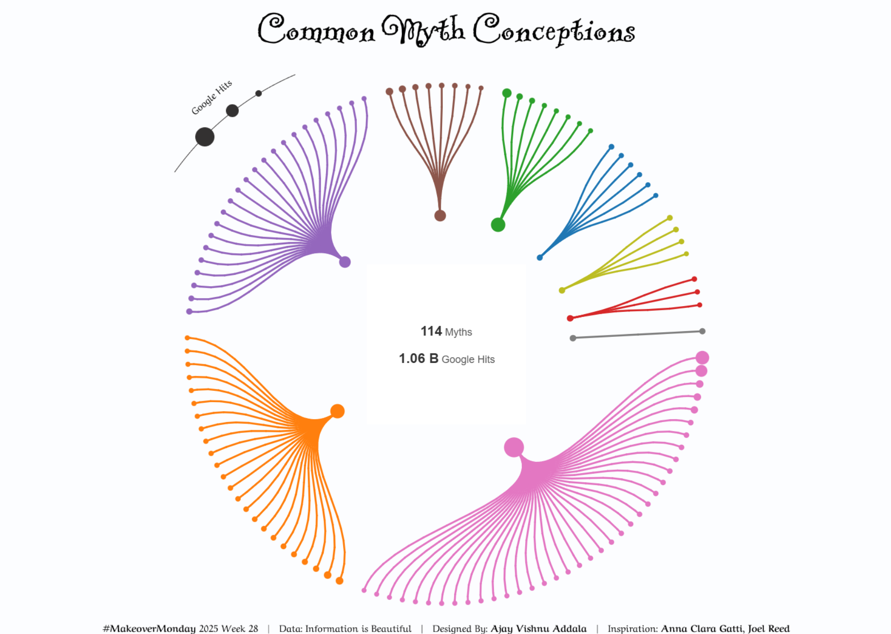

# 💭 Common Misconceptions – #MakeoverMonday Viz

## 📊 Overview
This project is a data visualization created for the [#MakeoverMonday](https://www.makeovermonday.co.uk/) challenge, focusing on **over 100 widely believed misconceptions** across domains like science, health, religion, food, and more.

Using a **radial tree map** in Tableau, myths are grouped into 10 categories — such as Science, Health, Mind, Religion — based on a refined classification system. Each node represents a misconception, colored by category and sized by Google hit counts, showing how deeply rooted some of these false beliefs remain.

👉 **[View the interactive Tableau dashboard here](https://public.tableau.com/views/CommonMythConceptionsMOM2025W28/MOMWeek28?:language=en-US&publish=yes&:sid=&:redirect=auth&:display_count=n&:origin=viz_share_links)**

---

## 🔍 Key Insights

- **“A gene for…”** tops the list with **375M+ Google hits**, revealing how misunderstood genetics still dominates public thinking.
- Tech and science myths like **“We only use 10% of our brains”**, **“Glass is a liquid”**, and **“Apple Macs can’t get viruses”** show how outdated ideas persist in modern times.
- Even simple everyday myths — like the **“5-second rule”** (96M+) or **“Napoleon was short”** (33M+) — continue to thrive due to repetition rather than truth.

---

## 📁 Files

- `README.md` – this file
- `data/common_myths.csv` – cleaned dataset used in Tableau
- `images/common-myths-dashboard.png` – snapshot of the final viz
- `tableau/common_myths.twbx` – Tableau workbook file (optional)

---

## 📦 Tools Used

- Tableau Public
- Data cleaning in Excel
- Categorization logic inspired by natural domain groupings

---

## 🤝 Credits

- Original data source: [#MakeoverMonday Dataset](https://www.makeovermonday.co.uk/data/)
- Classification and visualization by [Your Name](https://www.linkedin.com/in/yourprofile)

